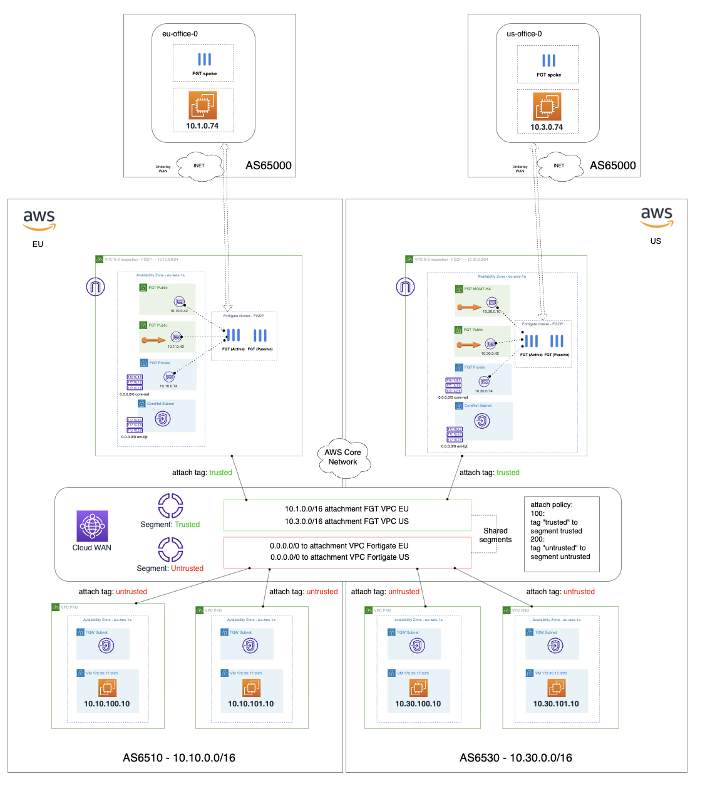

# Example: Forigate AWS Cloud WAN integration

Example of integration Fortinet SDWAN and AWS Cloud WAN

## Deployment overview

This example demonstrates a FortiGate AWS Cloud WAN integration architecture with:

- **EU Hub**: FortiGate instances deployed in Europe region acting as SDWAN hubs
- **EU SDWAN Spokes**: FortiGate instances configured as SDWAN spoke sites
- **Core Network Spokes**: VPCs attached to AWS Cloud WAN for centralized connectivity
- **Route53 Health Checks**: Monitoring and failover capabilities for VPN endpoints
- **Multi-region deployment**: Spanning across regions with centralized management

The architecture leverages AWS Cloud WAN for global network connectivity while FortiGate instances provide SDWAN capabilities and security services.

<!-- BEGIN_TF_DOCS -->
## Requirements

| Name | Version |
|------|---------|
|  [aws](#requirement\_aws) | ~> 5.0 |

## Providers

| Name | Version |
|------|---------|
|  [aws](#provider\_aws) | ~> 5.0 |
|  [http](#provider\_http) | n/a |
|  [local](#provider\_local) | n/a |
|  [random](#provider\_random) | n/a |
|  [tls](#provider\_tls) | n/a |

## Modules

| Name | Source | Version |
|------|--------|---------|
|  [eu\_hub](#module\_eu\_hub) | ../../modules/fgt | v0.0.1 |
|  [eu\_hub\_config](#module\_eu\_hub\_config) | ../../modules/fgt_config | v0.0.1 |
|  [eu\_hub\_nis](#module\_eu\_hub\_nis) | ../../modules/fgt_ni_sg | v0.0.1 |
|  [eu\_hub\_vm](#module\_eu\_hub\_vm) | ../../modules/vm | v0.0.1 |
|  [eu\_hub\_vpc](#module\_eu\_hub\_vpc) | ../../modules/vpc | v0.0.1 |
|  [eu\_hub\_vpc\_routes](#module\_eu\_hub\_vpc\_routes) | ../../modules/vpc_routes | v0.0.1 |
|  [eu\_sdwan](#module\_eu\_sdwan) | ../../modules/fgt | n/a |
|  [eu\_sdwan\_config](#module\_eu\_sdwan\_config) | ../../modules/fgt_config | n/a |
|  [eu\_sdwan\_nis](#module\_eu\_sdwan\_nis) | ../../modules/fgt_ni_sg | n/a |
|  [eu\_sdwan\_vm](#module\_eu\_sdwan\_vm) | ../../modules/vm | n/a |
|  [eu\_sdwan\_vpc](#module\_eu\_sdwan\_vpc) | ../../modules/vpc | n/a |
|  [eu\_sdwan\_vpc\_routes](#module\_eu\_sdwan\_vpc\_routes) | ../../modules/vpc_routes | n/a |
|  [eu\_spoke\_to\_core\_net](#module\_eu\_spoke\_to\_core\_net) | ../../modules/vpc | v0.0.1 |
|  [eu\_spoke\_to\_core\_net\_routes](#module\_eu\_spoke\_to\_core\_net\_routes) | ../../modules/vpc_routes | v0.0.1 |
|  [eu\_spoke\_to\_core\_net\_vm](#module\_eu\_spoke\_to\_core\_net\_vm) | ../../modules/vm | v0.0.1 |

## Resources

| Name | Type |
|------|------|
| [aws_key_pair.eu_keypair](https://registry.terraform.io/providers/hashicorp/aws/latest/docs/resources/key_pair) | resource |
| [aws_key_pair.us_keypair](https://registry.terraform.io/providers/hashicorp/aws/latest/docs/resources/key_pair) | resource |
| [aws_networkmanager_vpc_attachment.eu_hub_vpc_core_net_attachment](https://registry.terraform.io/providers/hashicorp/aws/latest/docs/resources/networkmanager_vpc_attachment) | resource |
| [aws_networkmanager_vpc_attachment.eu_spoke_to_core_net_attachment](https://registry.terraform.io/providers/hashicorp/aws/latest/docs/resources/networkmanager_vpc_attachment) | resource |
| [aws_route53_health_check.eu_hub_vpn_fqdn_hck_parent](https://registry.terraform.io/providers/hashicorp/aws/latest/docs/resources/route53_health_check) | resource |
| [aws_route53_health_check.eu_hub_vpn_fqdn_hcks](https://registry.terraform.io/providers/hashicorp/aws/latest/docs/resources/route53_health_check) | resource |
| [aws_route53_record.eu_hub_vpn_fqdn](https://registry.terraform.io/providers/hashicorp/aws/latest/docs/resources/route53_record) | resource |
| [aws_route53_record.eu_hub_vpn_fqdn_fgts](https://registry.terraform.io/providers/hashicorp/aws/latest/docs/resources/route53_record) | resource |
| [local_file.ssh_private_key_pem](https://registry.terraform.io/providers/hashicorp/local/latest/docs/resources/file) | resource |
| [random_string.api_key](https://registry.terraform.io/providers/hashicorp/random/latest/docs/resources/string) | resource |
| [random_string.vpn_psk](https://registry.terraform.io/providers/hashicorp/random/latest/docs/resources/string) | resource |
| [tls_private_key.ssh](https://registry.terraform.io/providers/hashicorp/tls/latest/docs/resources/private_key) | resource |
| [aws_route53_zone.route53_zone](https://registry.terraform.io/providers/hashicorp/aws/latest/docs/data-sources/route53_zone) | data source |
| [http_http.my-public-ip](https://registry.terraform.io/providers/hashicorp/http/latest/docs/data-sources/http) | data source |

## Inputs

| Name | Description | Type | Default | Required |
|------|-------------|------|---------|:--------:|
|  [access\_key](#input\_access\_key) | Access and secret keys to your environment | `any` | n/a | yes |
|  [secret\_key](#input\_secret\_key) | n/a | `any` | n/a | yes |

## Outputs

| Name | Description |
|------|-------------|
|  [eu\_hub\_ids](#output\_eu\_hub\_ids) | ----------------------------------------------------------------------------------------------------- EU - EMEA HUB ----------------------------------------------------------------------------------------------------- |
|  [eu\_hub\_ni\_list](#output\_eu\_hub\_ni\_list) | n/a |
|  [eu\_hub\_vm](#output\_eu\_hub\_vm) | n/a |
|  [eu\_sdwan\_ids](#output\_eu\_sdwan\_ids) | ----------------------------------------------------------------------------------------------------- EU SDWAN SPOKES ----------------------------------------------------------------------------------------------------- |
|  [eu\_sdwan\_ni\_list](#output\_eu\_sdwan\_ni\_list) | n/a |
|  [eu\_sdwan\_vm](#output\_eu\_sdwan\_vm) | n/a |
|  [eu\_spoke\_to\_core\_net\_vm](#output\_eu\_spoke\_to\_core\_net\_vm) | ----------------------------------------------------------------------------------------------------- EU CORENET SPOKES ----------------------------------------------------------------------------------------------------- |
<!-- END_TF_DOCS -->

## Support
This a personal repository with goal of testing and demo Fortinet solutions on the Cloud. No support is provided and must be used by your own responsability. Cloud Providers will charge for this deployments, please take it in count before proceed.